<!-- Reemplaza TU_USERNAME y TU_LINKEDIN con tus datos reales -->

<div align="center">



<br />

[](https://github.com/23Maykol)
[](https://www.linkedin.com/in/maykol-litari/)
[](https://github.com/23Maykol)

</div>

<br />

## `~/sobre-mi`

Soy estudiante de **Desarrollo de Software**, enfocado principalmente en el desarrollo web y de aplicaciones. Me interesa crear soluciones con distintas tecnologías, tanto APIs y aplicaciones web como aplicaciones móviles. Actualmente fortalezco mis conocimientos mediante proyectos académicos y personales.

```json
{
  "rol": "Estudiante de Desarrollo de Software",
  "enfoque": ["Desarrollo web", "Aplicaciones móviles"],
  "intereses": [
    "Desarrollo de APIs",
    "Bases de datos",
    "Arquitectura y patrones de diseño",
    "Análisis de datos y Business Intelligence"
  ],
  "estado": "Aprendiendo y construyendo proyectos"
}
```


## `~/stack`

<table>
  <tr>
    <td width="22%"><code>web</code></td>
    <td></td>
  </tr>
  <tr>
    <td><code>mobile</code></td>
    <td></td>
  </tr>
  <tr>
    <td><code>bases-de-datos</code></td>
    <td>
      <br />
      <code>SQL</code> <code>Entity Framework Core</code>
    </td>
  </tr>
  <tr>
    <td><code>datos</code></td>
    <td>
      <br />
      Explorando: <code>Pandas</code> <code>Matplotlib</code> <code>Power BI</code>
    </td>
  </tr>
  <tr>
    <td><code>herramientas</code></td>
    <td></td>
  </tr>
</table>


## `~/proyectos`

<table>
  <tr>
    <td width="50%" valign="top">
      <h3><code>01</code> API de gestión de tienda</h3>
      <p>API organizada para gestionar la información de una tienda mediante operaciones CRUD, con separación de responsabilidades y documentación en Swagger.</p>
      <p><code>C#</code> <code>ASP.NET Core</code> <code>Entity Framework Core</code> <code>MySQL</code> <code>Repository Pattern</code> <code>Unit of Work</code> <code>Swagger</code></p>
    </td>
    <td width="50%" valign="top">
      <h3><code>02</code> Desarrollo web con Next.js</h3>
      <p>Proyecto web con interfaces basadas en componentes, enfoque en SEO y optimización, y despliegue en Vercel.</p>
      <p><code>Next.js</code> <code>TypeScript</code> <code>Vercel</code></p>
    </td>
  </tr>
  <tr>
    <td width="50%" valign="top">
      <h3><code>03</code> Aplicaciones móviles con Flutter</h3>
      <p>Aplicaciones con diseño de interfaces, navegación y conexión con servicios y APIs.</p>
      <p><code>Flutter</code> <code>Dart</code></p>
    </td>
    <td width="50%" valign="top">
      <h3><code>04</code> Proyectos de análisis de datos</h3>
      <p>Proyectos académicos para explorar datos, aplicar transformaciones y crear visualizaciones.</p>
      <p><code>Python</code> <code>Pandas</code> <code>Matplotlib</code></p>
    </td>
  </tr>
</table>


## `~/aprendiendo`

```yaml
aprendiendo:
  - APIs con .NET
  - Desarrollo web con Next.js
  - Desarrollo móvil con Flutter
  - SQL y bases de datos
  - Arquitectura y patrones de diseño
  - Análisis de datos y Business Intelligence
```


## `~/objetivo`

```csharp
// Seguir creciendo como desarrollador de software, fortaleciendo mis
// conocimientos en desarrollo web, aplicaciones móviles, APIs y bases
// de datos, mientras continúo explorando nuevas áreas de la tecnología.
```


## `~/contacto`

<div align="center">

[](https://github.com/TU_USERNAME)
[](TU_LINKEDIN)

</div>

```bash
$ echo "Siempre aprendiendo, siempre construyendo."
Siempre aprendiendo, siempre construyendo.
```
